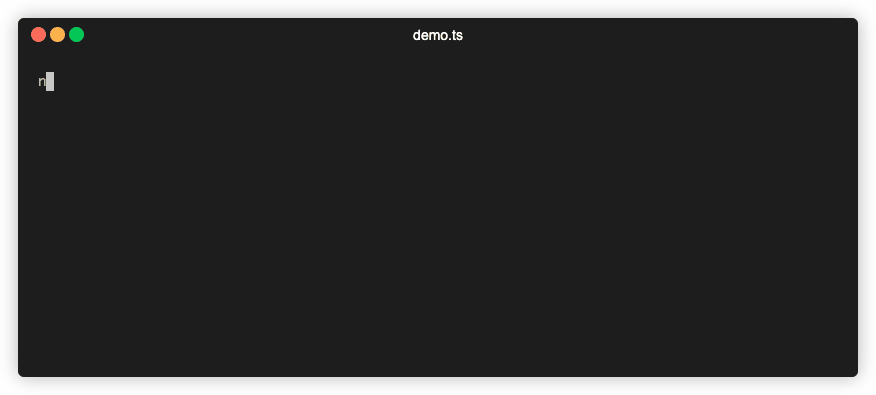

# cached-async-fnc

A typesafe function execution cache that prevents execution if the function gets the same arguments twice.


You can find the code for the demo [here](demo/demo.ts)

## Features

- ✅&nbsp; Full type safety when using typescript
- ☀️&nbsp; Lightweight. No other dependencies will come with this package
- ♻️&nbsp; Supports concurrent requests. If the same query is executed twice all following queries will wait until the first one resolves and reuse the data
- 🛠&nbsp; Available as CommonJS and ESM build

## Install

```shell
# For npm
npm install --save cached-async-fnc

# For yarn
yarn add --save cached-async-fnc

# For pnpm
pnpm install --save cached-async-fnc
```

## Getting started

```typescript
import { createCachedAsyncFnc } from "cached-async-fnc";

// Small function to defer the promise for some time
function wait(ms: number) {
  return new Promise<void>((resolve) => {
    setTimeout(() => resolve(), ms);
  });
}

// This is the resolve function which will be executed. The types of the params and return are used later when you query the cache.
const resolveFnc = async (name: string) => {
  // Wait 1 seconds to simulate some async work
  await wait(1000);

  return "Hi " + name;
};

// Now we create the cache instance
const cache = createCachedAsyncFnc(resolveFnc);

// Wrap the code into so we can use await
async function main() {
  const req1 = await cache.get("Mark");
  const req2 = await cache.get("Mark");

  // The first request will trigger the resolve function
  console.log(req1.data, req1.status); // "Hi Mark", "MISS"

  // The seconds request will reuse the data from cache
  console.log(req2.data, req2.status); // "Hi Mark", "HIT"
}

main();
```

## API

### createCachedAsyncFnc(`resolverFunction, [options]`): cacheInstance

This function creates a cache instance for the given function. The `parameter` and `return` types will be reused by the cache.

```typescript
const resolveFnc = async (name: string) => {
  return "Hi " + name;
};

// optional config for the cache
const config = {
  debug: true,
};

// create the cache with the resolver function
const cache = createCachedAsyncFnc(resolveFnc, config);
```

#### config

- **debug**: boolean => Send log messages to console.log

### cache.get(`[...args]`): Promise

Now you can query your configured `resolverFunction` with full type checks for the parameters.

```typescript
const resolveFnc = async (name: string, age: number) => {
  return `${name} is ${age} years old`;
};

// create the cache with the resolver function
const cache = createCachedAsyncFnc(resolveFnc);

const response = await cache.get("Mark", 25);
```

#### Response

- **status**: string => The status tells you if the response were cached or not
- - "HIT" the request was already cached
- - "MISS" the request was not cached and must be resolved with your `resolverFunction`
- **data**: any => This is data your `resolverFunction` returns
- **ms**: number => Time in miliseconds of the request

## TODO's
- [ ] Create a browser version
- [ ] Create a Deno version
